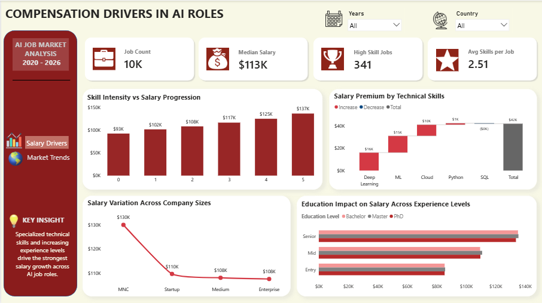
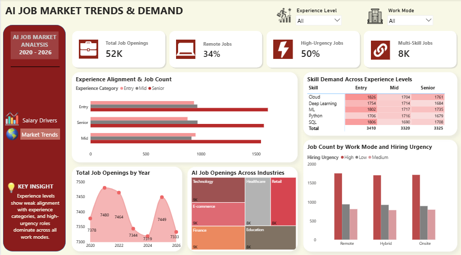

# AI Job Market Analysis (2020-2026)
This project analyzes an AI job market dataset to explore how job trends vary across skills, experience levels, countries, industries, and other market factors.

## Project Overview
The job market trends are analyzed from 2020 to 2026. Compensation is used as the primary metric to evaluate how different factors influence the AI job market. The dataset contains multiple variables, with skills (Python, SQL, Cloud, ML, and deep learning) and experience level emerging as the most influential drivers of salary. Hiring trends are also examined across countries, industries, years and experience levels. In addition, hiring urgency is analyzed to understand how it is distributed across different work modes.

## Tools & Technologies
The tools and technologies used for this project are:
- Python
- Pandas
- SQL
- Power BI
- DAX
- Data Modeling (Bridge Tables)

## Workflow
The dataset was sourced from Kaggle and imported into Python for preprocessing. The initial step involved checking for duplicates and null values. New variables such as total skills and experience categories were created using feature engineering for deeper analysis. 
Once the data was cleaned, analytical functions like groupby, crosstab, and pivot_table were applied to answer key business questions and extract insights from the data. 
After completing Python preprocessing, the cleaned dataset was exported from Python to SQL for further analysis using structured queries to validate and extend the findings. 
The final stage involved building an interactive dashboard in Power BI for storytelling and visualization. In Power BI, the analysis was structured into two layers. 
- The first focused on compensation variations across different factors.
- The second focused on hiring trends across multiple dimensions in the AI job market.
 All required measures were created using DAX to ensure efficient and dynamic calculations.

## Key Insights
- Compensation increases significantly with skill intensity, rising from ~93K to ~137K as skill count increases from 0 to 5. 
- AI skills influence compensation more as Deep Learning (~16K), Machine Learning (~15K), and Cloud (~10K) have the highest salary premium compared to Python and SQL.
- There is weak alignment between job-defined experience levels and experience categories derived from years of experience, as only 33% of experience levels correspond to experience categories.
- Company sizes have a moderate impact on salary, with only MNCs outperforming others with a median salary of ~130K, while other types clustered around ~108K.
- Education has a limited impact on compensation, with only ~1-2K variation across degree levels when experience levels are controlled.
- Industries and countries have a moderate impact on compensation.
- The highest-paying roles (~118K) are high-urgency positions and also account for the largest share of job postings across all work modes.

## Key Takeaways:
The analysis highlights that skill intensity and experience levels are the strongest drivers of compensation than countries and industries. A notable finding is the weak alignment between job-defined experience levels and experience categories derived from years of experience, suggesting that skills and role requirements play a more important role in career progression more than tenure alone. Moreover, education shows a limited impact on compensation, indicating that experience levels and skill sets play a more significant role in determining salary outcomes.

## Future Improvements:
- Incorporate real-time data on the job market for analysis.
- Develop predictive algorithms to forecast hiring demand and salaries.
- Add more countries and industries to the dataset.
- Track new AI skills and how they affect compensation trends.

## Dashboard Overview
The dashboard consists of two pages. The first page focuses on the key factors influencing compensation in the AI job market. It includes KPI cards highlighting job count, average skills per job, median salary, and high-skill jobs. Interactive slicers for years and countries are included to allow users to explore compensation trends across different regions and time periods.
The second page focuses on hiring patterns and workforce demand. It includes KPI cards summarizing total job openings, high-urgency jobs, remote jobs, and multi-skill jobs. Experience level and work mode slicers are included to enable deeper analysis of hiring trends across different segments of the AI job market. 

### Page 1: Compensation Drivers in AI Roles

  

 

---

### Page 2: AI Job Market Trends & Demand

  

 

 
